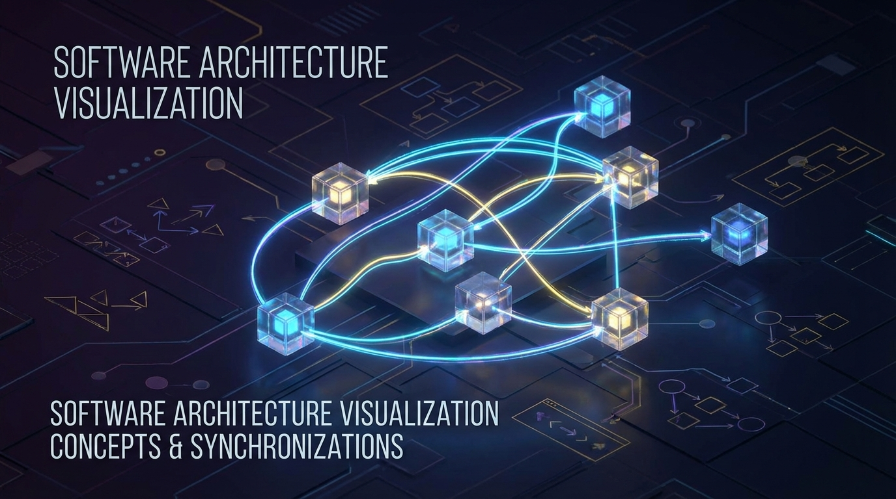
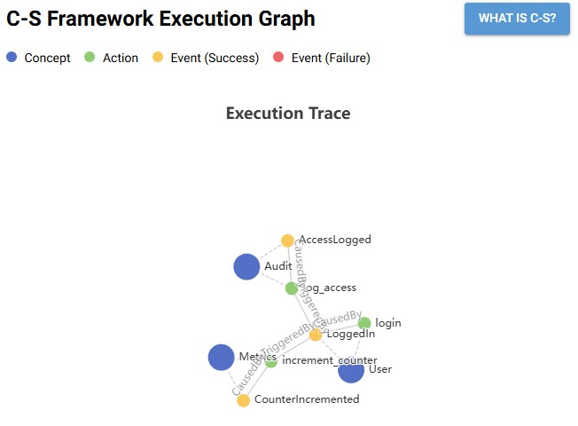

# C-S Framework for Python




[English](./README.md) | [日本語](./README.ja.md)

Concept-Synchronization (C-S) 憲章を実装したPythonフレームワークです。

## インストール

```bash
pip install cs-framework
```

開発用:

```bash
git clone https://github.com/shuntacurosu/cs-framework.git
cd cs-framework
pip install -e .[dev]
```

## 使い方

### デモの実行

1. サンプルアプリケーションを実行します:
   ```bash
   python src/examples/simple_demo/main.py
   ```
   これにより `execution.ttl` ファイルが生成されます。

2. 可視化GUIを実行します:
   ```bash
   csfw gui --log execution.ttl
   ```
   ブラウザで `http://localhost:8080` を開いてください。

   

## 構造

- `src/cs_framework`: コアフレームワークライブラリ。
- `src/cs_gui`: NiceGUIを使用した可視化ツール。
- `src/examples`: 使用例。
- `tests`: 単体テストおよび統合テスト。

## テスト

```bash
pytest
```

## スキル駆動開発ワークフロー

C-S Framework は、AI エージェント（スキル）と協調して開発することを前提に設計されています。以下は、Pacman の実装例に基づいた標準的な開発フローです。

### 1. 設計 & スキャフォールディング (Architect Skill)

新しい Concept（概念）を作成する際は、`Architect` ツールを使用します。これにより、イベント定義や Pydantic モデルを含む堅牢な雛形が生成されます。

```bash
# 例: Pacman コンセプトの生成
csfw scaffold \
  --name Pacman \
  --actions move change_direction die teleport \
  --events moved died \
  --output src/examples/pacman/src/concepts/
```

### 2. 実装 (Implementation)

生成されたファイルを編集し、ロジックを実装します。

- **Python (`src/concepts/*.py`)**: 単体の振る舞い（Action）と状態遷移を実装します。イベントは Pydantic モデルを通じて型安全に発行 (`emit`) します。
- **YAML (`src/sync/rules.yaml`)**: Concept 間の相互作用（イベント → アクションの連鎖）を定義します。コードを変更せずにゲームルールを調整できます。

### 3. 静的解析 (Linter Skill)

実装したコードと YAML 定義の整合性をチェックします。未定義のアクションや、どこにも繋がっていないイベント（孤立したイベント）を検出できます。

```bash
csfw lint --path src/examples/pacman/src
```

### 4. 検証 & デバッグ (Fuzzer Skill)

バグの再現や仕様の確認には、シナリオテストを使用します。

1. **シナリオ作成**: `scenario.yaml` に一連のイベントと期待される状態（アサーション）を記述します。
2. **実行**:
   ```bash
   csfw run-scenario \
     src/examples/pacman/run.py \
     src/examples/pacman/scenario_bug_repro.yaml
   ```

### 5. 分析 (Debugger Skill)

実行ログは RDF (`execution.ttl`) として保存されます。SPARQL クエリを用いて、イベントの連鎖やその時のペイロード（状態）を詳細に分析できます。

## Spec-Kit 統合

[Spec-Kit](https://github.com/spec-kit/spec-kit) と統合することで、AI主導の開発プロセスにおいてフレームワークのベストプラクティスを強制することができます。

```bash
# Spec-Kit テンプレートに CSFW のルールを統合
python -m cs_framework.cli integrate-speckit
```

このコマンドは、ローカルの `.specify/` 設定を変更し、AIエージェントが以下のルールに従うようにします：
1. Concept-Synchronization アーキテクチャに従うこと。
2. 新しい Concept の作成には `scaffold.py` を使用すること。
3. 検証のために `lint.py` を実行すること。

## 参考文献

- [What You See Is What It Does: A Structural Pattern for Legible Software](https://arxiv.org/pdf/2508.14511) (arXiv:2508.14511)
